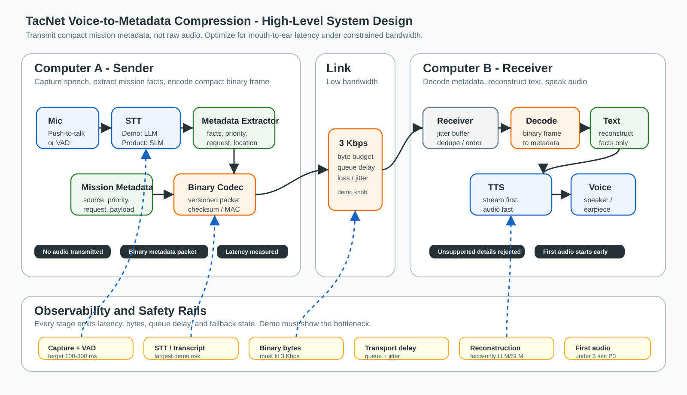

# TacNet Voice Compression Architecture

## Purpose

Design an end-to-end low-bandwidth voice pipeline where one computer captures
speech, extracts mission metadata from that speech, removes non-operational
content, encodes the metadata into a compact binary frame, transmits that frame
over a constrained link, and the receiving computer expands it back into spoken
audio.

The product target is on-device SLMs. The current P0 demo target uses local
`whisper.cpp` on Mac laptops so the audio-to-text path works without OpenAI or
internet access during operation.

## Core Principle

Do not transmit audio. Transmit compact mission metadata.

Audio is high bandwidth and fragile under tactical links. TacNet should convert
speech into structured mission facts, transmit those facts as binary, then
reconstruct a concise human-readable utterance and speak it on the receiving side.

## High-Level Diagram



## Devil's Advocate Component Stack

Use existing platforms wherever they fit. The demo should validate the pipeline,
latency budget, and byte savings, not spend time building audio, networking, or
model infrastructure from scratch.

Only two criteria matter here: speed and accuracy.

| Architecture part | Best fit | Rejected/default-lower alternatives | Decision |
|---|---|---|---|
| App shell | React/Vite client with FastAPI control plane and metrics | Native mobile first, ATAK first, React Native | Keep browser for P0 because it proves latency fastest. Move to Android/ATAK after proof. |
| Microphone capture | `getUserMedia` + AudioWorklet PCM + push-to-talk | MediaRecorder, hot mic first | Replace MediaRecorder as primary. Containerized chunks add latency. |
| VAD / turn boundary | Push-to-talk for P0 | Hot mic VAD, server VAD, semantic VAD | PTT is operationally accurate and avoids false cuts in noise. |
| STT | Local `whisper.cpp` with `base.en` | OpenAI Realtime, batch transcription endpoint | P0 must work offline; hosted STT remains optional for comparison only. |
| Local STT path | `whisper.cpp` first, Cactus/Gemma later on mobile | Gemma-only assumption | Mac laptop P0 should prove the full offline loop before the mobile SLM path. |
| Metadata extraction | Deterministic parsers for SALUTE/ACE/LACE + Structured Outputs fallback | Pure LLM extraction, regex-only | Known report types should not wait on a model; ambiguous speech can use schema-constrained LLM. |
| Schema validation | Shared JSON Schema, Zod in TypeScript, Pydantic in Python | Pydantic-only, Zod-only | Validate every model and decode boundary. |
| Metadata debug form | JSON only for UI inspection | Transmit JSON | JSON is for humans; never the constrained-link payload. |
| Binary encoding | CBOR with integer keys + codebook IDs | MessagePack, Protobuf, custom bit packing | CBOR is standard, compact, and debuggable. Protobuf is viable once schema freezes. |
| Link proof | WebRTC DataChannel with byte/loss/jitter shaper | FastAPI WebSocket as main proof | DataChannel better matches peer-to-peer realtime delivery; FastAPI stays control/metrics. |
| Receiver decode | Deterministic frame parser with version, sequence, timestamp, checksum | Raw CBOR decode only | Reliability fields are required for honest latency/accuracy metrics. |
| Text reconstruction | Deterministic templates from verified metadata | Hosted LLM rewrite by default | Templates are fastest and cannot invent facts. LLM rewrite is optional polish only. |
| Voice output | Streaming PCM/WAV TTS | Browser SpeechSynthesis as primary | Streaming first audio matters more than voice quality. Browser voice is fallback only. |
| Local TTS path | Platform TTS or Piper/OHF-style local TTS | Voice cloning | Local, predictable, and fast beats expressive voice for this product. |
| Metrics | Monotonic stage timestamps + byte counters + first-audio callback | Browser logs only | Measure mouth start, transcript delta, metadata stable, bytes queued, frame received, first audio. |
| Security | Checksum for P0; AEAD later | Claim production encryption in demo | Accuracy first; do not imply COMSEC before it exists. |

## Architecture Decisions

- Replace MediaRecorder with AudioWorklet PCM frames for the primary P0 path.
- Use local `whisper.cpp` with `base.en` for P0 audio-to-text.
- Use deterministic metadata extraction for known report formats before LLM
  fallback.
- Use deterministic receiver templates by default; LLM rewrite is disabled unless
  latency budget still passes.
- Use WebRTC DataChannel for the binary payload proof; keep FastAPI for setup,
  control, and observability.
- Keep CBOR for P0 binary encoding, but use integer keys and codebook IDs from
  the beginning.
- Benchmark local STT before committing to Cactus/Gemma, MediaPipe, or
  `whisper.cpp` for the product path.

## End-to-End Flow

1. Sender captures audio from the microphone.
2. Voice activity detection cuts speech into short utterance chunks.
3. Demo path sends a local WAV clip to `whisper.cpp`; product path uses an
   on-device SLM or STT model.
4. The transcript is normalized into a mission-safe text form.
5. A metadata extractor removes unnecessary words and keeps mission facts:
   speaker, location, status, request, destination, priority, and timestamp.
6. A binary codec packs the metadata object into a versioned frame.
7. The sender transmits frames through a constrained link with priority ordering.
8. Receiver validates frame version, checksum, sequence, and payload type.
9. Receiver decodes the binary frame into structured text intent.
10. Receiver uses deterministic templates to generate output text from verified
    metadata; optional LLM polish is disabled unless latency budget still passes.
11. TTS starts speaking as soon as the first stable phrase is available.
12. Metrics report mouth-to-ear latency, bytes sent, compression ratio, and
    dropped or delayed frames.

## Demo Scope

The demo should prove the complete shape without pretending every production
piece is done.

### P0 Demo

- [ ] Two computers or two browser clients: sender and receiver.
- [ ] Push-to-talk or hold-to-record capture.
- [ ] Offline `whisper.cpp` speech-to-text with `base.en`.
- [ ] Mission metadata extraction for known report types.
- [ ] Remove filler, repetition, hesitation, and non-operational wording.
- [ ] Binary frame encoding of the extracted metadata payload.
- [ ] Low-bandwidth channel simulator set to a visible target, such as 3 Kbps.
- [ ] Receiver decodes binary back into structured text.
- [ ] Deterministic templates reconstruct receiver text from metadata.
- [ ] Receiver reconstructs readable text from decoded metadata.
- [ ] Latency timeline displays every stage.
- [ ] Manual transcript fallback works if local STT is unavailable.

### P1 Demo Hardening

- [ ] Stream partial transcripts instead of waiting for final transcript.
- [ ] Start binary transmission when intent is stable, not when speech fully ends.
- [ ] Add packet sequence numbers, duplicate suppression, and late-packet handling.
- [ ] Add canned tactical examples: SALUTE, ACE/LACE, UAS observation, sensor
      trigger, and free-form commander note.
- [ ] Add side-by-side comparison: raw audio bytes vs transcript bytes vs binary
      metadata bytes.

## Metadata Extraction Layer

The critical compression step is audio-to-metadata, not audio-to-transcript.
Wrapping a transcript in JSON is only modestly useful. The model or parser must
extract intent, entities, locations, priority, request type, and timestamps.

Example:

> Alpha Two is at grid 12345678, one casualty, low ammo, requesting resupply at
> checkpoint Bravo.

Metadata:

```json
{
  "speaker": "Alpha Two",
  "location": "12345678",
  "status": ["1 casualty", "low ammo"],
  "request": "resupply",
  "destination": "checkpoint Bravo",
  "priority": "medium"
}
```

Planning estimate: a 10-second speech report at 6 kbit/s is about 7.5 KB before
network overhead. The structured metadata above is roughly 150-300 bytes as JSON
and can plausibly become 50-150 bytes after binary encoding. The demo should
measure this live and show the compression ratio instead of hard-coding a claim.

### P2 Prototype

- [ ] Benchmark Cactus/Gemma and other local mobile STT/SLM paths.
- [ ] Add real two-machine networking over LAN WebSocket or WebRTC data channel.
- [ ] Add link shaping for bandwidth, jitter, and packet loss.
- [ ] Add local TTS fallback.
- [ ] Add phrase dictionary and domain-specific codebook.

### P3 Field Path

- [ ] Move STT, intent extraction, reconstruction, and TTS fully on-device.
- [ ] Run over BLE, LoRa, SDR, or tactical radio bridge.
- [ ] Add encryption and authenticated packets.
- [ ] Add offline model packaging and first-launch model download.
- [ ] Validate power, thermal, and battery impact.

## Binary Frame Concept

The binary payload should be a versioned semantic frame, not just UTF-8 text
renamed as binary.

| Field | Purpose |
|---|---|
| Magic/version | Reject incompatible packets cleanly. |
| Packet type | Report, query, ack, correction, heartbeat, or control. |
| Sequence | Reorder and drop duplicates. |
| Timestamp | Compute latency and freshness. |
| Source node | Identify sender without verbose labels. |
| Priority | Contact, casualty, sensor trigger, routine status. |
| Intent type | SALUTE, ACE, LACE, UAS observation, free text. |
| Codebook id | Allows both sides to share compact vocabulary. |
| Payload | Compact fields or phrase tokens. |
| Checksum/MAC | Detect corruption and support authenticated transport later. |

The first demo can use MessagePack, CBOR, or a small custom binary layout. The
production design should settle this only after we know whether exact replay,
schema evolution, or minimum byte count matters most.

## Latency Budget

The user experience target should be "radio-natural," not batch-processing.
Measure time to first audible output, not only time to full completed speech.

| Stage | Demo Target | Product Target | Notes |
|---|---:|---:|---|
| Capture + VAD chunk | 100-300 ms | 50-150 ms | Short chunks feel natural but risk bad transcripts. |
| Speech-to-text | 300-1000 ms | 200-800 ms | Biggest early risk. Use streaming partials. |
| Intent extraction | 100-500 ms | 50-250 ms | Deterministic parser for known report types is fastest. |
| Binary encode + queue | <20 ms | <10 ms | Should be negligible. |
| Low-bandwidth transport | 50-1000 ms | Link-dependent | Payload must be small enough to fit the pipe. |
| Decode + reconstruct text | 20-150 ms | 20-150 ms | Deterministic templates are the default. |
| TTS first audio | 300-1200 ms | 100-500 ms | Stream audio as soon as a phrase is stable. |

P0 success threshold: the receiver starts speaking in under 3 seconds for a
short message, with metrics showing where the time was spent.

Target product feel: under 1 second for short structured reports, with degraded
mode preferring short robotic accuracy over fluent but late speech.

## Senior Architecture Steps

1. Lock the product contract.
   Decide whether the receiver must reproduce exact words or only operational
   meaning. Exact reconstruction costs bandwidth and latency.

2. Define the P0 message set.
   Start with five utterance families: SALUTE, ACE/LACE, UAS observation,
   sensor trigger, and free-form commander note.

3. Define the binary semantic frame.
   Version it from day one. Include sequence, source, timestamp, priority,
   intent type, payload, and checksum.

4. Build the latency harness first.
   Every stage emits timing events. The demo should show capture start,
   transcript ready, binary sent, binary received, text reconstructed, and first
   audio played.

5. Implement deterministic extraction for structured reports.
   Use LLM only for fallback or polish. Deterministic extraction keeps latency
   predictable and avoids invented facts.

6. Add model adapters behind interfaces.
   P0 uses `whisper.cpp`. The production adapter should be swappable for
   Cactus/Gemma or another on-device SLM path.

7. Build the link simulator.
   Enforce actual byte budgets. Queue high-priority frames first. Show raw text
   exceeds the pipe while binary semantic frames fit.

8. Build receiver reconstruction.
   Convert decoded frames into terse operational English before TTS. Do not let
   the receiving LLM add unsupported details.

9. Add streaming TTS.
   First audio should begin as soon as the first stable sentence is available.
   Waiting for the whole reconstructed response will make it feel unnatural.

10. Add reliability controls.
    Sequence numbers, duplicate suppression, late packet handling, and visible
    link metrics matter more than a polished UI.

11. Add security only after the demo path works.
    For production, use authenticated encryption. For P0, document that packet
    integrity is a placeholder and do not imply classified readiness.

12. Run the demo over two physical machines.
    Browser tabs are acceptable for early development, but the final proof
    should show sender and receiver separated by an actual constrained channel.

## Recommended Implementation Shape

| Layer | P0 Choice | Later Choice |
|---|---|---|
| Audio capture | Browser microphone or simple desktop client | Native iOS/Android capture |
| STT | Local `whisper.cpp` with `base.en` | Benchmarked mobile STT: Cactus/Gemma, MediaPipe, or native ASR |
| Intent extraction | Deterministic parser + Structured Outputs fallback | On-device SLM + deterministic guardrails |
| Binary codec | CBOR with integer keys + codebook IDs | Protobuf or custom bit frame after schema freezes |
| Transport | WebRTC DataChannel with byte-budget shaper | BLE/LoRa/SDR/tactical radio |
| Reconstruction | Deterministic templates from decoded metadata | On-device SLM polish if latency permits |
| Voice output | Streaming PCM/WAV TTS | Platform TTS or local TTS/vocoder |
| Metrics | Browser/server event timeline | Device-level telemetry |

## Locked P0 Decisions

1. Preserve operational meaning, not exact wording.
2. Run first on Mac laptops.
3. Use local `whisper.cpp` with `base.en` for audio-to-text.
4. Use push-to-talk, not hot mic.
5. Transmit CBOR metadata over WebRTC DataChannel.
6. Shape the link to 3 Kbps with jitter.
7. Reconstruct text on the receiver; voice output is optional for P0.
8. Use checksum-only integrity for P0 and do not claim COMSEC readiness.

## Risks

| Risk | Mitigation |
|---|---|
| Local STT latency makes the demo feel slow | Keep reports short, default to CPU-safe `base.en`, and show stage timing. |
| LLM invents details during reconstruction | Reconstruct only from decoded fields; reject unsupported additions. |
| Binary frame becomes unreadable during debugging | Add a decoder panel showing frame fields and byte count. |
| TTS waits for full text | Stream first phrase as soon as stable. |
| Link simulator is fake-looking | Display byte budget, raw bytes, binary bytes, and queue delay live. |
| "Binary" is just text bytes | Use a real fielded semantic frame and show the byte delta. |

## Implementation Lock

P0 is locked to local Mac laptop STT, deterministic metadata extraction, CBOR
binary payloads, WebRTC DataChannel transport, and receiver text reconstruction.
Cactus/Gemma, Bluetooth mesh, ATAK, authenticated encryption, and streaming TTS
belong after the offline P0 loop is reliable.

## References

- CBOR / RFC 8949: https://www.rfc-editor.org/rfc/rfc8949.html
- Protocol Buffers: https://protobuf.dev/overview/
- WebRTC data channels: https://webrtc.org/getting-started/data-channels
- MDN MediaStream Recording API: https://developer.mozilla.org/en-US/docs/Web/API/MediaStream_Recording_API
- MDN AudioWorklet: https://developer.mozilla.org/en-US/docs/Web/API/AudioWorklet
- Cactus on-device AI docs: https://cactuscompute.com/docs
- Google MediaPipe LLM Inference API: https://ai.google.dev/edge/mediapipe/solutions/genai/llm_inference/android
- llama.cpp: https://github.com/ggml-org/llama.cpp
- whisper.cpp: https://github.com/ggml-org/whisper.cpp
- Zod: https://zod.dev/
- Pydantic: https://docs.pydantic.dev/
